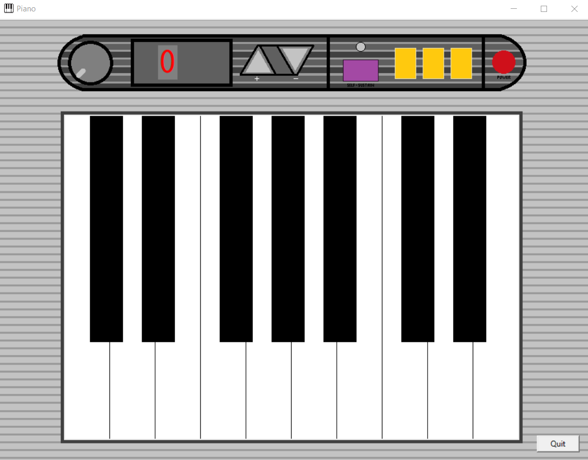
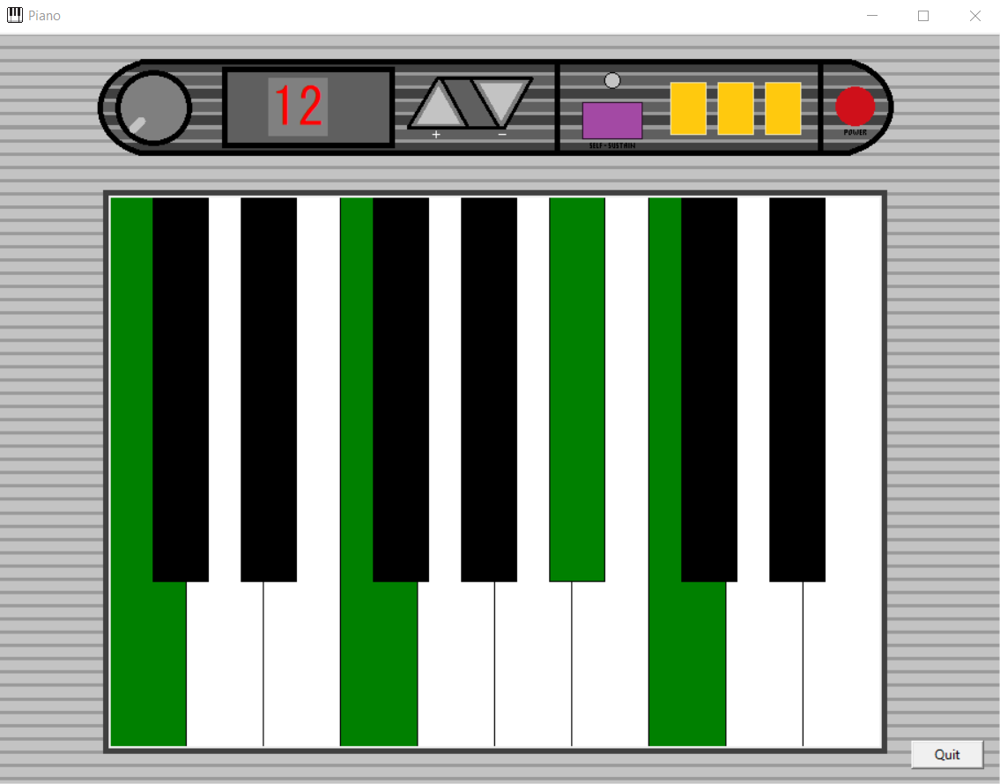

# Mini-Piano

## Description
Hello everyone and welcome to this Mini-Piano project where i simply wanted to recreate as the name says, a small piano.
There is some features to it, inspired by a small Yamaha model such as the transpose and the sustain pedal.
I also added a trace mode, useful only if you have the terminal while run the app, allowing you to see every action you do : Features (de)activated, transpose changed, key pressed and note played.

## Controls
NOTE : It is adapted for AZERTY keyboard layout and since i haven't added controls configurations, it's not suited for QWERTY one.
### To play each note
W = C3
S = C3#
X = D3
D = D3#
C = E3
V = F3
G = F3#
B = G3
H = G3#
N = A3
J = A3#
, = B3
; = C4
L = C4#
: = D4
M = D4#
! = E4

### Features
LEFT  = transpose to a lower semitone/half step
RIGHT = transpose to a upper semitone/half step
Shift + LEFT = transpose to a lower octave
Shift + RIGHT = transpose to a upper octave
Control + T = enable/disable trace mode
Control + S = enable/disable sustain_pedal feature

When i say LEFT and RIGHT, I mean the left and right arrow keys

## Author
Realized by Henrique D.M.M

## Demo images
### Keyboard

### Pressing keys on the keyboard and transposing notes

